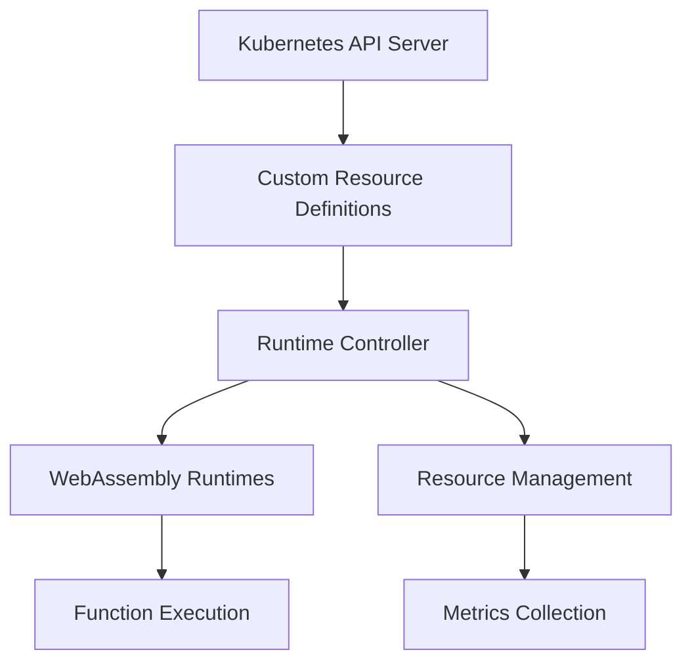

# Phase 2: WebAssembly Runtime Environment - Detailed Implementation Guide

## 1. Introduction

### 1.1 Purpose
This phase implements the core WebAssembly runtime environment within our Kubernetes cluster. The implementation enables:
- Dynamic loading and execution of WebAssembly modules
- Resource isolation and management
- Runtime lifecycle management
- Function deployment and scaling

### 1.2 Architecture Overview


## 2. Custom Resource Definitions (CRDs)

### 2.1 WasmRuntime CRD
This CRD defines the WebAssembly runtime environment specifications.

```yaml
# CRD Definition with Detailed Annotations
apiVersion: apiextensions.k8s.io/v1
kind: CustomResourceDefinition
metadata:
  name: wasmruntimes.wasm.bits-dissertation.io
spec:
  group: wasm.bits-dissertation.io
  versions:
    - name: v1alpha1
      served: true
      storage: true
      schema:
        openAPIV3Schema:
          type: object
          properties:
            spec:
              type: object
              properties:
                # Runtime type (wasmtime/wasmedge)
                runtime:
                  type: string
                  enum: ["wasmtime", "wasmedge"]
                  description: "WebAssembly runtime engine to use"
                
                # Runtime version control
                version:
                  type: string
                  description: "Version of the runtime engine"
                
                # Resource allocation
                resources:
                  type: object
                  properties:
                    memory:
                      type: string
                      pattern: '^[0-9]+Mi$'
                    cpu:
                      type: string
                      pattern: '^[0-9]+m$'
```

**Implementation Notes:**
1. **Runtime Selection:** Supports multiple runtime engines
2. **Version Management:** Enables runtime version control
3. **Resource Controls:** Defines resource allocation limits

### 2.2 Function Deployment Process
```bash
# Step-by-step function deployment
1. Compile WebAssembly module
wat2wasm source.wat -o function.wasm

2. Create function deployment
kubectl apply -f - <<EOF
apiVersion: wasm.bits-dissertation.io/v1alpha1
kind: WasmFunction
metadata:
  name: example-function
spec:
  runtime: wasmedge
  source: function.wasm
  entrypoint: main
  resources:
    memory: "128Mi"
    cpu: "100m"
EOF

3. Verify deployment
kubectl get wasmfunction example-function
```

## 3. Runtime Controller Implementation

### 3.1 Controller Architecture
```python
# Key controller components
class RuntimeController:
    def __init__(self):
        self.watch_functions()
        self.manage_resources()
        self.monitor_health()

    def reconcile(self):
        """
        Main reconciliation loop:
        1. Check current state
        2. Compare with desired state
        3. Make necessary adjustments
        4. Update status
        """
```

### 3.2 Resource Management
```yaml
# Resource management configuration
resource_management:
  memory:
    pooling:
      enabled: true
      initial_size: "1Gi"
      increment: "256Mi"
    
  cpu:
    scheduling:
      policy: "fair-share"
      quota_period: "100ms"
    
  storage:
    type: "persistent"
    size: "10Gi"
    class: "standard"
```

## 4. Testing Framework

### 4.1 Unit Tests
```python
# Example test cases
def test_runtime_creation():
    """
    Test steps:
    1. Create runtime instance
    2. Verify configuration
    3. Check resource allocation
    4. Validate status
    """

def test_function_deployment():
    """
    Test steps:
    1. Deploy WebAssembly function
    2. Verify execution
    3. Check resource usage
    4. Validate output
    """
```

### 4.2 Integration Tests
```bash
# Integration test suite
#!/bin/bash

# 1. Environment setup
setup_test_environment() {
    create_test_namespace
    deploy_test_resources
    wait_for_readiness
}

# 2. Runtime tests
test_runtime_operations() {
    verify_runtime_creation
    check_resource_allocation
    validate_runtime_status
}

# 3. Function tests
test_function_lifecycle() {
    deploy_test_function
    verify_execution
    check_scaling
    cleanup_resources
}
```

## 5. Performance Optimization

### 5.1 Memory Management
```rust
// Memory optimization strategy
pub struct MemoryManager {
    /// Pool of pre-allocated pages
    page_pool: Vec<Page>,
    
    /// Memory usage statistics
    stats: MemoryStats,
}

impl MemoryManager {
    /// Initialize memory pool
    pub fn init(&mut self) {
        self.pre_allocate_pages();
        self.setup_monitoring();
    }
    
    /// Handle page allocation
    pub fn allocate(&mut self, size: usize) -> Result<Page, Error> {
        // Implementation details
    }
}
```

### 5.2 Runtime Optimization
```yaml
# Runtime optimization settings
optimization:
  jit:
    enabled: true
    cache_size: "100MB"
    
  compilation:
    optimization_level: 2
    debug_info: false
    
  execution:
    thread_pool_size: 4
    max_instances: 10
```

## 6. Monitoring and Metrics

### 6.1 Metrics Collection
```python
# Metrics collection system
class MetricsCollector:
    def __init__(self):
        self.setup_prometheus()
        self.initialize_collectors()
    
    def collect_runtime_metrics(self):
        """
        Collect:
        1. Memory usage
        2. CPU utilization
        3. Function execution time
        4. Error rates
        """
```

### 6.2 Alert Configuration
```yaml
# Alert rules
alerts:
  memory_usage:
    threshold: 85%
    window: 5m
    
  function_errors:
    threshold: 5
    interval: 1m
    
  latency:
    p95: 100ms
    p99: 200ms
```

## 7. Security Implementation

### 7.1 Runtime Security
```rust
// Security implementation
pub struct SecurityManager {
    /// Sandbox configuration
    sandbox_config: SandboxConfig,
    
    /// Permission management
    permissions: Permissions,
}

impl SecurityManager {
    /// Initialize security controls
    pub fn init(&mut self) {
        self.setup_sandbox();
        self.configure_permissions();
    }
}
```

### 7.2 Access Control
```yaml
# RBAC configuration
rbac:
  roles:
    - name: wasm-admin
      rules:
        - apiGroups: ["wasm.bits-dissertation.io"]
          resources: ["wasmruntimes", "wasmfunctions"]
          verbs: ["*"]
    
    - name: wasm-viewer
      rules:
        - apiGroups: ["wasm.bits-dissertation.io"]
          resources: ["wasmruntimes", "wasmfunctions"]
          verbs: ["get", "list", "watch"]
```

## 8. Deployment Guide

### 8.1 Prerequisites
```bash
# System requirements verification
check_requirements() {
    verify_kubernetes_version
    check_memory_availability
    validate_permissions
    test_network_connectivity
}
```

### 8.2 Installation Steps

1. **Prepare Environment**
```bash
# 1. Verify Kubernetes cluster
kubectl cluster-info

# 2. Create namespaces
kubectl create namespace wasm-system
kubectl create namespace wasm-functions

# 3. Install prerequisites
kubectl apply -f https://github.com/cert-manager/cert-manager/releases/latest/download/cert-manager.yaml
```

2. **Deploy CRDs and Controllers**
```bash
# Apply Custom Resource Definitions
kubectl apply -f config/crds/wasm-runtime.yaml
kubectl apply -f config/crds/wasm-function.yaml

# Deploy controller
kubectl apply -f config/controller/runtime-controller.yaml

# Verify installations
kubectl get crds | grep wasm
kubectl get pods -n wasm-system
```

3. **Configure Runtime Environment**
```yaml
# Example runtime configuration
apiVersion: wasm.bits-dissertation.io/v1alpha1
kind: WasmRuntime
metadata:
  name: wasmedge-runtime
spec:
  runtime: wasmedge
  version: "0.11.2"
  resources:
    requests:
      memory: "256Mi"
      cpu: "200m"
    limits:
      memory: "512Mi"
      cpu: "500m"
```

4. **Verify Installation**
```bash
# Check runtime status
kubectl get wasmruntime

# Verify controller logs
kubectl logs -n wasm-system deployment/wasm-runtime-controller

# Test basic functionality
kubectl apply -f examples/hello-world-function.yaml
```

## 9. Troubleshooting Guide

### 9.1 Common Issues

1. **CRD Installation Failures**
   ```bash
   # Problem: CRDs not appearing
   kubectl get crds | grep wasm
   
   # Solution:
   kubectl delete -f config/crds/
   kubectl apply -f config/crds/
   ```

2. **Controller Startup Issues**
   ```bash
   # Check controller logs
   kubectl logs -n wasm-system deployment/wasm-runtime-controller
   
   # Common solutions:
   # 1. Check RBAC permissions
   kubectl describe clusterrole wasm-controller-role
   
   # 2. Verify resource availability
   kubectl describe nodes | grep -A 5 "Allocated resources"
   ```

3. **Runtime Initialization Errors**
   ```bash
   # Check runtime pod events
   kubectl get events -n wasm-system --sort-by='.lastTimestamp'
   
   # Verify runtime configuration
   kubectl describe wasmruntime <runtime-name>
   ```

4. **Function Deployment Issues**
   ```yaml
   # Common fixes in function spec
   apiVersion: wasm.bits-dissertation.io/v1alpha1
   kind: WasmFunction
   metadata:
     name: troubleshoot-function
   spec:
     runtime: wasmedge  # Verify runtime exists
     source: function.wasm  # Check path
     resources:
       memory: "128Mi"  # Adjust if OOM occurs
   ```

### 9.2 Debug Procedures

1. **System Verification**
   ```bash
   #!/bin/bash
   
   debug_installation() {
     echo "=== Checking System Status ==="
     
     # 1. Verify CRDs
     kubectl get crds | grep wasm
     
     # 2. Check controller status
     kubectl get pods -n wasm-system
     
     # 3. Verify RBAC
     kubectl auth can-i create wasmruntime --all-namespaces
     
     # 4. Check resources
     kubectl describe nodes
   }
   ```

2. **Runtime Diagnostics**
   ```bash
   debug_runtime() {
     # 1. Check runtime pods
     kubectl get pods -l app=wasm-runtime -A
     
     # 2. Verify configurations
     kubectl get wasmruntime -o yaml
     
     # 3. Test connectivity
     kubectl exec -it <runtime-pod> -- curl localhost:8080/health
   }
   ```

3. **Log Collection**
   ```bash
   collect_logs() {
     # Create debug directory
     mkdir -p debug-logs
     
     # Collect controller logs
     kubectl logs -n wasm-system deployment/wasm-runtime-controller > debug-logs/controller.log
     
     # Gather runtime logs
     kubectl logs -l app=wasm-runtime -A > debug-logs/runtime.log
     
     # Save events
     kubectl get events -A > debug-logs/events.log
   }
   ```

## 10. References and Resources

### 10.1 API Documentation

1. **Runtime API**
   ```rust
   /// Runtime Management API
   pub trait RuntimeManager {
       /// Initialize new runtime
       fn init_runtime(config: RuntimeConfig) -> Result<Runtime>;
       
       /// Load WebAssembly module
       fn load_module(wasm: &[u8]) -> Result<Module>;
       
       /// Execute function
       fn execute(module: &Module, func: &str, params: &[Value]) -> Result<Vec<Value>>;
   }
   ```

2. **Function API**
   ```rust
   /// Function Management API
   pub trait FunctionManager {
       /// Deploy new function
       fn deploy(spec: FunctionSpec) -> Result<Function>;
       
       /// Update existing function
       fn update(name: &str, spec: FunctionSpec) -> Result<Function>;
       
       /// Delete function
       fn delete(name: &str) -> Result<()>;
   }
   ```

3. **Metrics API**
   ```rust
   /// Metrics Collection API
   pub trait MetricsCollector {
       /// Collect runtime metrics
       fn collect_runtime_metrics() -> Result<RuntimeMetrics>;
       
       /// Collect function metrics
       fn collect_function_metrics(func: &str) -> Result<FunctionMetrics>;
   }
   ```

### 10.2 Configuration Templates

1. **Basic Runtime Configuration**
   ```yaml
   # runtime-config.yaml
   apiVersion: wasm.bits-dissertation.io/v1alpha1
   kind: WasmRuntime
   metadata:
     name: production-runtime
   spec:
     runtime: wasmedge
     version: "0.11.2"
     resources:
       requests:
         memory: "512Mi"
         cpu: "500m"
       limits:
         memory: "1Gi"
         cpu: "1000m"
     security:
       seccomp: runtime/default
       allowPrivilegeEscalation: false
   ```

2. **Function Deployment Template**
   ```yaml
   # function-template.yaml
   apiVersion: wasm.bits-dissertation.io/v1alpha1
   kind: WasmFunction
   metadata:
     name: example-function
   spec:
     runtime: wasmedge
     source: "https://github.com/example/function.wasm"
     entrypoint: "main"
     resources:
       memory: "128Mi"
       cpu: "100m"
     scaling:
       minReplicas: 1
       maxReplicas: 5
       targetCPUUtilization: 80
     security:
       networkPolicy: restricted
   ```

3. **Monitoring Configuration**
   ```yaml
   # monitoring-config.yaml
   apiVersion: monitoring.bits-dissertation.io/v1alpha1
   kind: WasmMonitoring
   metadata:
     name: runtime-monitoring
   spec:
     metrics:
       prometheus:
         enabled: true
         port: 9090
       custom:
         collection_interval: "30s"
         retention_period: "7d"
     alerts:
       memory_threshold: "85%"
       cpu_threshold: "80%"
       error_rate_threshold: "5%"
     dashboard:
       enabled: true
       refresh_rate: "30s"
   ```
