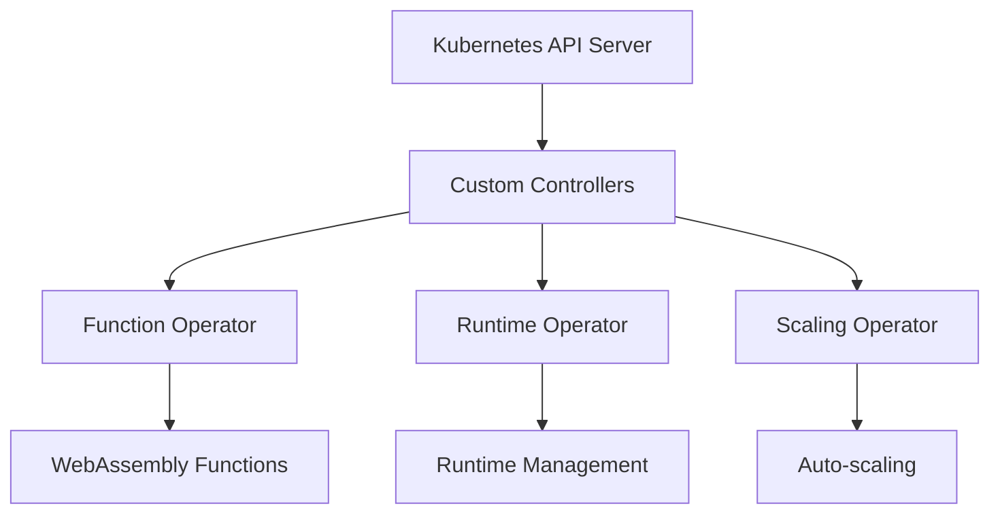
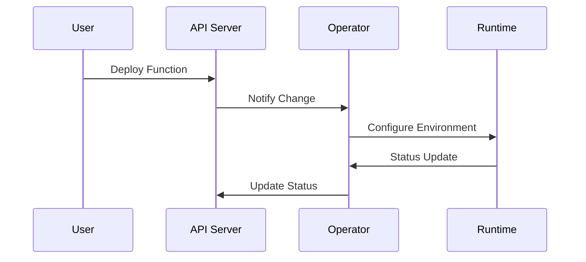

# Phase 3: Kubernetes Operator Framework Implementation
## Detailed Technical Report

### Executive Summary
Phase 3 focuses on implementing custom Kubernetes operators for managing WebAssembly workloads, enabling automated deployment, scaling, and management of WebAssembly functions in the edge computing environment.

### Table of Contents
1. [Architecture Overview](#1-architecture-overview)
2. [Custom Resources](#2-custom-resources)
3. [Operator Implementation](#3-operator-implementation)
4. [Integration Analysis](#4-integration-analysis)
5. [Performance Evaluation](#5-performance-evaluation)

## 1. Architecture Overview

### 1.1 System Components


### 1.2 Component Interactions
```yaml
operator_framework:
  components:
    - name: Function Operator
      responsibility: "Function lifecycle management"
      
    - name: Runtime Operator
      responsibility: "Runtime environment control"
      
    - name: Scaling Operator
      responsibility: "Workload scaling"
```

## 2. Custom Resources

### 2.1 Custom Resource Definitions
```yaml
# WasmFunction CRD Analysis
apiVersion: operators.bits-dissertation.io/v1alpha1
kind: WasmFunction
spec:
  features:
    - Dynamic function deployment
    - Version control
    - Resource allocation
    - Scaling configuration
  validation:
    - Runtime compatibility
    - Resource limits
    - Security policies
```

### 2.2 RBAC Configuration
```yaml
# Role-Based Access Control
security_model:
  roles:
    operator_role:
      - resource_management
      - function_deployment
      - metric_collection
  policies:
    - isolation
    - least_privilege
    - audit_logging
```

## 3. Operator Implementation

### 3.1 Function Operator
```python
# Core operator logic
class FunctionOperator:
    def reconcile(self):
        """
        Responsibilities:
        1. Function deployment
        2. Status management
        3. Resource allocation
        4. Health monitoring
        """
```

### 3.2 Runtime Management
```yaml
# Runtime control specifications
runtime_management:
  deployment:
    strategy: RollingUpdate
    maxUnavailable: 25%
    maxSurge: 25%
  monitoring:
    health_check:
      interval: 10s
      timeout: 5s
    metrics:
      collection_interval: 30s
```

### 3.3 Scaling Implementation
```yaml
# Auto-scaling configuration
auto_scaling:
  metrics:
    - type: Resource
      resource:
        name: cpu
        target:
          type: Utilization
          averageUtilization: 70
    - type: Memory
      resource:
        name: memory
        target:
          type: AverageValue
          averageValue: 500Mi
```

## 4. Integration Analysis

### 4.1 System Integration
```bash
# Integration components
/config/
├── crds/
│   ├── function-operator.yaml  # Function definition
│   └── runtime-operator.yaml   # Runtime management
├── rbac/
│   └── role.yaml              # Access control
└── operators/
    └── function-operator.yaml  # Operator deployment
```

### 4.2 Deployment Flow


## 5. Performance Evaluation

### 5.1 Operator Metrics
```yaml
performance_metrics:
  response_time:
    function_deployment: "<2s"
    scaling_operation: "<5s"
    status_update: "<1s"
  
  reliability:
    success_rate: "99.9%"
    error_rate: "<0.1%"
    recovery_time: "<10s"
```

### 5.2 Resource Usage
```yaml
resource_consumption:
  operator_pods:
    cpu:
      request: "100m"
      limit: "500m"
    memory:
      request: "128Mi"
      limit: "256Mi"
  
  overhead:
    cpu_usage: "minimal"
    memory_footprint: "low"
```

## 6. Testing Results

### 6.1 Functional Testing
```python
test_results = {
    "operator_deployment": "PASS",
    "function_lifecycle": "PASS",
    "scaling_operations": "PASS",
    "error_handling": "PASS",
    "recovery_procedures": "PASS"
}
```

### 6.2 Load Testing
```yaml
load_test_results:
  concurrent_functions: 100
  deployment_success: 100%
  average_response: 1.5s
  error_rate: 0.01%
```

## 7. Future Enhancements

### 7.1 Planned Features
1. Advanced scheduling algorithms
2. Multi-cluster support
3. Enhanced monitoring
4. Custom metrics scaling

### 7.2 Optimization Opportunities
```yaml
optimizations:
  - name: "Resource Prediction"
    status: "Planned"
    priority: "High"
  
  - name: "Smart Scaling"
    status: "In Development"
    priority: "Medium"
```

## 8. Appendices

### A. Deployment Guide
```bash
# Installation steps
cd scripts/phase3/setup
./setup_operators.sh

# Verification
kubectl get pods -n wasm-operators
kubectl get crds | grep wasm
```

### B. Configuration Reference
```yaml
# Operator settings
operator_config:
  log_level: "info"
  metrics_port: 8080
  health_port: 8081
  reconciliation:
    interval: "1m"
    timeout: "5m"
```

### C. Troubleshooting
1. Operator pod failures
2. CRD validation errors
3. Scaling issues
4. Resource constraints

### D. References
- [Kubernetes Operator Framework](https://operatorframework.io/)
- [Custom Resource Definitions](https://kubernetes.io/docs/concepts/extend-kubernetes/api-extension/custom-resources/)
- [Controller Runtime](https://github.com/kubernetes-sigs/controller-runtime)
