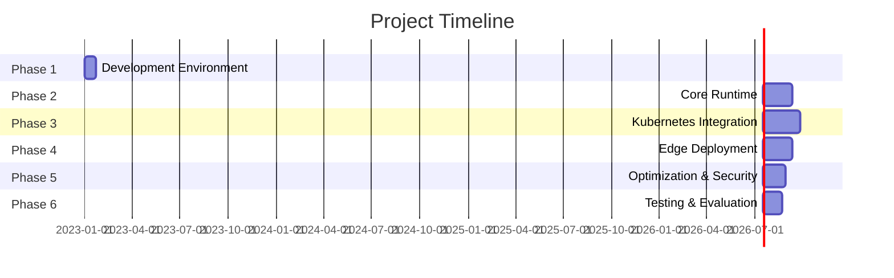

# WebAssembly Edge Computing Implementation Roadmap 🚀

## Overview
This document outlines the implementation plan for developing a WebAssembly-based edge computing platform integrated with Kubernetes.

## Table of Contents
- [Phase 1: Development Environment](#phase-1-development-environment-setup-) 🛠
- [Phase 2: Core Runtime](#phase-2-core-runtime-development-) ⚡
- [Phase 3: Kubernetes Integration](#phase-3-kubernetes-integration-) ☸️
- [Phase 4: Edge Deployment](#phase-4-edge-deployment-system-) 🌐
- [Phase 5: Optimization & Security](#phase-5-optimization--security-) 🔒
- [Phase 6: Testing & Evaluation](#phase-6-testing--evaluation-) 🧪
- [Deliverables](#deliverables-) 📦
- [Timeline](#timeline-) 📅
- [Risk Mitigation](#risk-mitigation-) ⚠️

## Phase 1: Development Environment Setup 🛠
### 1.1 Development Infrastructure
- 🔧 Set up local Kubernetes cluster (k3s/k3d)
- 📦 Install WebAssembly runtime (wasmtime/wasmedge)
- 🔄 Configure CI/CD pipeline
- 💻 Set up development tools
- 📊 Configure monitoring stack

### 1.2 Testing Environment
- 🧪 Configure test frameworks
- 📈 Set up performance testing tools
- 🤖 Implement automated testing
- 📉 Create baseline metrics system

## Phase 2: Core Runtime Development ⚡
### 2.1 Wasm Runtime Integration
- 🔌 Implement module loader
- ⚙️ Develop configuration manager
- 💾 Create caching system
- 🧮 Implement memory management
- 📊 Build metrics collector

### 2.2 Function Execution Engine
- 🎯 Develop trigger system
- 🔄 Implement event routing
- 📝 Create context manager
- 💽 Build state handler
- ❌ Implement error handling
- 🔗 Design function chaining

## Phase 3: Kubernetes Integration ☸️
### 3.1 Custom Resource Definitions
- 📄 Design WasmFunction CRD
- 🏃 Create WasmRuntime CRD
- 🎮 Implement FunctionTrigger CRD
- 🛣️ Develop FunctionRoute CRD

### 3.2 Kubernetes Operators
- 🚀 Function deployment operator
- 🎛️ Runtime management operator
- ⚖️ Scaling operator
- 🔀 Routing operator
- 💓 Health check system

### 3.3 Resource Management
- 📊 Resource allocation strategy
- 📈 Auto-scaling mechanism
- 👀 Resource monitoring
- 🔮 Load prediction
- ⚡ Resource optimization

## Phase 4: Edge Deployment System 🌐
### 4.1 Edge Distribution
- 🤝 P2P function sharing
- 📡 Module distribution
- 🔍 Edge node discovery
- 🔋 Network optimization
- 💾 Edge caching

### 4.2 Service Mesh Integration
- 🔍 Service discovery
- ⚖️ Load balancing
- 🔀 Traffic routing
- 🔁 Retry mechanisms
- 📡 Cross-node communication

## Phase 5: Optimization & Security 🔒
### 5.1 Performance Optimization
- ⚡ Cold start optimization
- 💾 Memory usage optimization
- 🌐 Network latency reduction
- 📊 Resource utilization
- 🔥 Function warm-up

### 5.2 Security Implementation
- 🛡️ Security policies
- 🔐 Authentication system
- 🎫 Authorization framework
- 📝 Audit logging
- 🔒 Network isolation

## Phase 6: Testing & Evaluation 🧪
### 6.1 Performance Testing
- ⏱️ Function startup times
- 📈 Scalability tests
- 📊 Resource usage analysis
- 🌐 Network performance
- ⚡ Latency measurements

### 6.2 System Validation
- 🛡️ Security testing
- 🏋️ Load testing
- 💥 Failure scenarios
- ⚖️ Auto-scaling validation
- 📊 Resource optimization

## Deliverables 📦
### 7.1 Software Components
- 🔧 Wasm runtime integration
- ☸️ Kubernetes operators
- 🌐 Edge deployment system
- 📊 Management dashboard
- 💻 CLI tools

### 7.2 Documentation
- 📑 Architecture docs
- 📋 API specifications
- 📚 Deployment guides
- 📊 Performance reports
- 🔒 Security documentation

## Timeline 📅
**Total Duration: 30-40 weeks**

## Risk Mitigation ⚠️
### 9.1 Technical Risks
- 👥 Regular code reviews
- 🧪 Continuous testing
- 💾 Frequent backups
- 🔄 Version control
- 📝 Documentation updates

### 9.2 Project Risks
- 📊 Weekly progress tracking
- 👥 Regular supervisor meetings
- 📋 Backup implementation plans
- 🔄 Alternative technologies
- ⚠️ Resource contingency planning
